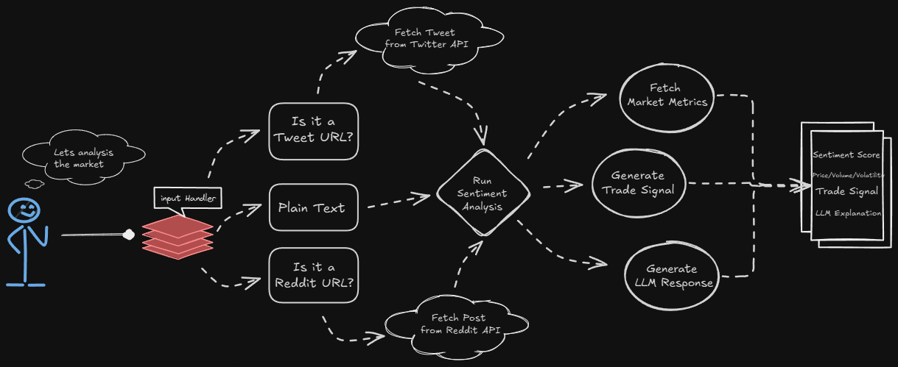
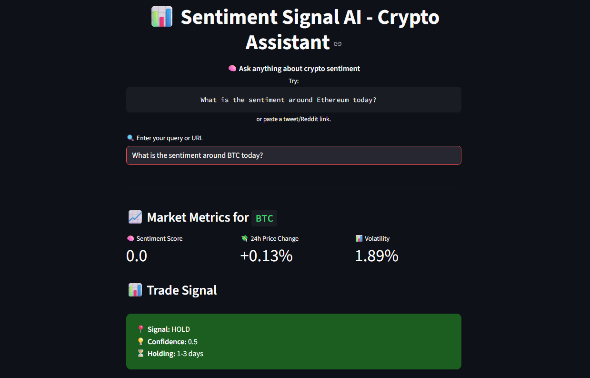
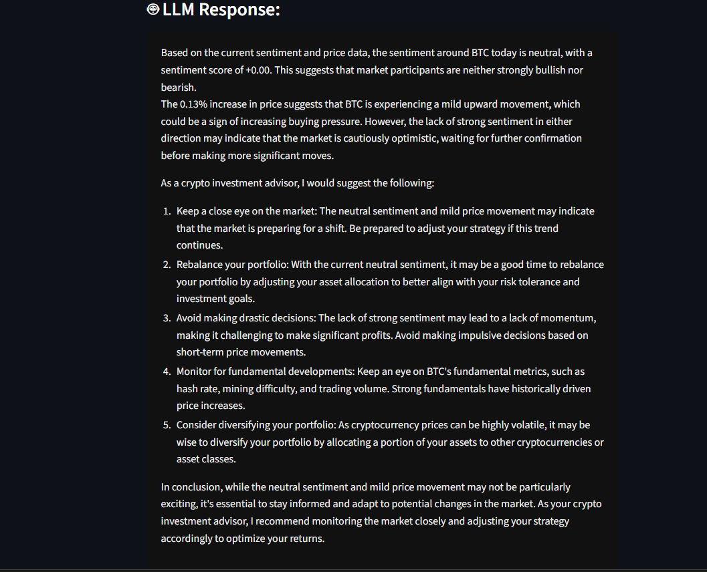

# 📊 Sentiment Signal AI - Crypto Assistant

**Sentiment Signal AI** is an intelligent crypto assistant that aggregates data from Twitter, Reddit, and news APIs, analyzes sentiment trends in real time, and provides actionable trade signals using LLM-powered 
decision-making.🔗 [Website-Link](http://?:8501/).

---

## 🚀 Features

- 🔎 Query sentiment around any crypto asset (e.g., "What is the sentiment around Ethereum today?")
- 🐦 Twitter / 👽 Reddit / 📰 News ingestion for real-time data
- 📈 Market metrics including price change, volume, and volatility
- 🤖 LLM-powered explanations and investment insights
- 📊 Trade Signal engine (Buy / Sell / Hold)
- 🌍 Geographic & language-based sentiment filtering
- 🕒 Real-time + historical sentiment trend support
- ☁️ **Production-ready AWS deployment with EC2, ALB, target groups, and secure networking (public/private subnets)**


---
## ☁️ AWS Deployment Architecture
The application is deployed across multiple availability zones using EC2 instances, an Application Load Balancer, target groups, and private/public subnets with custom firewalls.
## 🔁 Workflow Diagram

## 📸 App Preview


## 🛠️ Tech Stack

| Layer         | Technologies |
|---------------|--------------|
| **Frontend**  | Streamlit    |
| **Backend**   | Python, FastAPI  |
| **APIs**      | Twitter API v2, Reddit API, CoinGecko API, News API |
| **LLM**       | Groq + Mixtral via `groq_agent.py` |
| **Container** | Docker & Docker Compose |

---

## 📁 Project Structure

```bash
sentiment_signal_ai/
├── dashboard/                 # Streamlit UI
│   ├── app.py                 # Main app file
│   └── ui_components.py       # Custom styled components
│
├── utils/                     # Helper logic
│   ├── handlers.py            # Input routers (text, tweet, Reddit)
│   ├── helpers.py             # Shared functions (e.g., extract_ticker)
│   ├── market_utils.py        # Price, volume, volatility via CoinGecko
│   ├── sentiment_utils.py     # Sentiment scoring
│   ├── signal_utils.py        # Buy/Sell/Hold logic
│
├── data/                      # Data ingestion
│   ├── ingest_twitter.py      # Twitter fetch logic
│   ├── ingest_reddit.py       # Reddit fetch logic
│   ├── ingest_news.py         # News fetch logic
│
├── llm/                       # LLM Integration
│   └── groq_agent.py          # Prompt and response interface
│
├── Dockerfile
├── docker-compose.yml
├── requirements.txt
├── .env.example               # Sample environment vars
├── README.md
```
## ⚙️ Setup & Installation
1. Clone the repository
```bash
git clone https://github.com/yourusername/sentiment-signal-ai.git
cd sentiment-signal-ai
```
2. Install dependencies
```bash
python -m venv venv
source venv/bin/activate  # On Windows use venv\Scripts\activate
pip install -r requirements.txt
```
3. Configure Environment
```bash
cp .env.example .env
# Fill in your actual API keys in the .env file
```
4. Run the app
```bash
streamlit run dashboard/app.py
```
- App will be accessible at ```http://localhost:8501```

## 🐳 Docker Setup
1. Build & run using Docker Compose
```bash
docker-compose up --build
```
2. Open the browser
- Visit: ```http://localhost:8501```

## 🤝 Contributing
Pull requests are welcome! For major changes, please open an issue first to discuss what you would like to change.

